# Urban Farming -- Automated Plant Health Monitoring (Showcase)

**Course:** Deep Learning, M.Sc. Data Science & AI  
**Institution:** FH Wedel, SS 2025  
**Team Size:** 2  
**My Role:** Data Engineering, EDA, Modelling & Architecture Research

> This is a showcase repository. The full source code was developed as a university project hosted on FH Wedel's GitLab. This README documents the architecture, approach, and results.

---

## Problem

Urban farming operations need automated, real-time monitoring of plant health to detect diseases early. Manual inspection by humans is time-consuming, subjective, and does not scale. We built a hierarchical Deep Learning system that identifies the plant species, determines whether it is healthy or diseased, and -- when diseased -- classifies the specific condition, all from a single leaf image.

## Dataset

**31,616 curated images** across 3 plant species and 16 classes, compiled from multiple public sources:

| Plant | Classes | Examples |
|-------|---------|----------|
| **Lettuce** | 3 (healthy, bacterial, fungal) | 3,117 images. Viral cases merged with bacterial due to scarcity (~10 samples) |
| **Tomato** | 10 (healthy + 9 diseases) | 20,391 images. Most comprehensive coverage: bacterial spot, early/late blight, leaf mold, mosaic virus, septoria, spider mites, target spot, yellow leaf curl virus |
| **Strawberry** | 2 (healthy, leaf scorch) | 2,108 images. Binary classification |

**Split:** 70% train / 15% val / 15% test (stratified).

### Data Quality Pipeline

A critical part of the project. Initial exploration revealed severe quality issues that would have compromised all downstream results:

- **~30% of the raw dataset was irrelevant** (stock photos, prepared salads, non-plant images). Removed via manual review and embedding-based clustering
- **Data leakage detected:** duplicate and augmented images appeared across train/val/test splits. Eliminated using perceptual hashing and cross-split deduplication
- **Label inconsistencies** across sources required careful harmonization
- **Class imbalance:** healthy lettuce vastly outnumbered diseased specimens. Addressed through strategic class merging, inverse-frequency weighting, and focal loss

## Approach: Hierarchical Classification Pipeline

A three-stage pipeline designed for both accuracy and computational efficiency:

1. **PlantID (Stage i):** ResNet50 routes images to the correct plant species (3-class)
2. **Binary Health (Stage ii):** Per-plant models classify healthy vs. diseased. Focal loss handles class imbalance. **Healthy samples exit early** (~55-65% of traffic), skipping Stage iii entirely
3. **Disease Classification (Stage iii):** Per-plant disease models trained only when a plant has multiple disease classes. Plant-specific routing outperformed a single global classifier by ~6 percentage points

## System Architecture

## Key Results

### Per-Stage Performance

| Stage | Task | Accuracy |
|-------|------|----------|
| PlantID | 3-class plant identification | **99.9%** |
| Binary Health | Healthy vs. diseased (per-plant) | **99.7%** |
| Disease Classification | Disease-specific (per-plant) | **99.1%** |

### Per-Plant Binary Health Performance

| Plant | Precision | Recall | F1-Score | Best Model |
|-------|-----------|--------|----------|------------|
| Lettuce | 0.997 | 0.997 | 0.997 | ConvNeXt-Base |
| Tomato | 0.990 | 0.989 | 0.989 | ResNet50 |
| Strawberry | 0.999 | 0.999 | 0.999 | EfficientNet-B0 |

### Architecture Comparison (8+ models, 3 tiers)

| Model | Params | Val Acc. | Tier |
|-------|--------|----------|------|
| ViT-Base | 86M | 99.9% | Transformer |
| DINOv2 | 86M | 99.9% | Transformer |
| ConvNeXt-Base | 89M | 99.8% | Balanced |
| ResNet50 | 26M | 99.6% | Balanced |
| ConvNeXt-Tiny | 29M | 99.1% | Fast |
| EfficientNet-B0 | 5.3M | 98.9% | Fast |
| MobileNetV3 | 5.4M | 98.6% | Fast |

### Data Augmentation Ablation

| Augmentation | Val Acc. | Test Acc. | Generalization Gap |
|-------------|----------|-----------|-------------------|
| None (baseline) | 97.8% | 95.2% | 2.6pp |
| Light (flip + crop) | 98.1% | 97.3% | 0.8pp |
| Strong (full pipeline) | 99.1% | 98.9% | **0.2pp** |

Strong augmentation reduced the generalization gap by ~92%. Color jitter and perspective transforms were most effective for disease discrimination.

### Training Configuration Ablation

| Configuration | Val Acc. | Convergence | Stability |
|--------------|----------|-------------|-----------|
| AdamW baseline | 99.4% | >10 epochs | Moderate |
| + ReduceLROnPlateau | 99.5% | 9-10 | Good |
| + Class weighting | 99.7% | 8-10 | Good |
| + Multi-criteria early stopping | 99.8% | 6-10 | Excellent |
| + Label smoothing | 99.8% | 6-9 | Excellent |

## Critical Discovery: Domain Gap

The most important finding: models trained on **isolated leaf images** degrade significantly on **whole-plant scenes** with overlapping leaves, variable lighting, soil backgrounds, and different camera angles. This training-deployment domain gap is the primary bottleneck for real-world agricultural deployment. It surfaced during late-stage whole-plant trials (Week 8) and fundamentally shaped our recommendations for future work: spatial localization (leaf detection via YOLO) and whole-plant training data are the highest-priority next steps.

## Explainability

Two complementary approaches integrated into the Streamlit dashboard:

- **Grad-CAM** (CNNs): Gradient-weighted Class Activation Mapping highlights which image regions influenced the prediction. Auto-detects the correct target layer for each architecture. Heatmaps overlaid with adjustable transparency
- **Attention Rollout** (ViTs): Aggregates attention weights across all transformer layers to trace information flow from input patches to the final prediction. Shows global context understanding

Explainability serves both validation (are models focusing on actual disease features?) and education (helping agricultural professionals understand disease characteristics).

## Streamlit Dashboard

Interactive web application for plant health assessment:

- **Real-time inference:** Upload images or use camera, get immediate health assessment with confidence scores
- **Explainability overlay:** Toggle Grad-CAM heatmaps with adjustable opacity
- **Developer mode:** Launch training runs, architecture sweeps, data ingestion, model curation directly from the UI
- **Batch processing:** Process multiple images with export capabilities

## Tech Stack

- **Deep Learning:** PyTorch, timm, torchvision
- **Architectures:** ViT-Base, ViT-Small, DINOv2, ConvNeXt (Base/Tiny), ResNet-50, EfficientNet-B0, MobileNetV3
- **Explainable AI:** Grad-CAM, Transformer Attention Rollout
- **Training:** Transfer learning, AdamW, ReduceLROnPlateau, focal loss, label smoothing, class weighting, multi-criteria early stopping
- **UI:** Streamlit (1,734 lines of production code)
- **Data:** 31,616 curated images, perceptual hashing for deduplication, cross-split leak detection
- **Evaluation:** Automated sweep framework across 3 tiers, 5-fold stratified CV, JSON/CSV experiment logging

## My Contributions

| Area | Details |
|------|---------|
| **Data Collection & Cleaning** | Multi-source dataset merging, deduplication via perceptual hashing, quality assessment. Discovered and removed ~30% irrelevant data |
| **Data Preprocessing** | Train/val/test splitting (70/15/15), stratification, augmentation pipeline design and testing. Solved class imbalance through strategic merging and weighted loss |
| **Exploratory Data Analysis** | Statistical analysis, distribution visualization, class balance analysis, data quality pattern identification |
| **Model Development** | Architecture selection and hyperparameter tuning across 8+ architectures. Systematic comparison of CNNs vs. Transformers. Established robust training protocols |
| **Testing & Validation** | Model evaluation, performance comparison across architectures, metric aggregation |
| **Documentation** | Technical documentation, methodology writeup, comprehensive knowledge transfer materials |

Joint work with teammate (Jack Abajian, who led Streamlit development and Grad-CAM integration): architecture selection sessions, domain gap analysis, future work planning.

## Key Lessons

- **Data quality beats data quantity:** Targeted curation produced larger gains than adding more samples
- **Test early in real conditions:** The domain gap was invisible in controlled evaluation and only surfaced during whole-plant trials
- **Hierarchical routing pays off:** Plant-specific models with early exit beat a single global classifier in both accuracy (+6pp) and efficiency

---

*This project was developed as part of the Deep Learning course at FH Wedel (SS 2025). Full code is hosted on the university's GitLab. Total combined effort: 200 person-hours over 12 weeks.*
